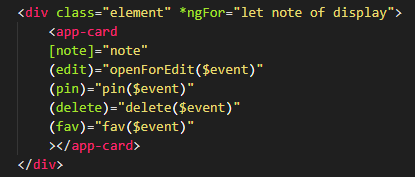

# Aplicación de notas en Angular

Este projecto consiste en una aplicación web para crear, administrar y eliminar notas, utilizando el framework de JavaScript para front-end, Angular. La aplicación ofrece un sistema de marcado de notas, lo que permite destacarlas en la parte superior de la página; también permite guardar notas para mostrarlas en una sección diferente del menú lateral, así como una papelera para almacenar las notas eliminadas. Las notas creadas se almacenan en el `localStorage`.

## Objetivo

El principal objetivo de crear este proyecto utilizando Angular es para entender y practicar las funcionalidades del framework Angular. 

## Conceptos de Angular utilizados

Entre las funcionalidades de Angular que se usaron en la implementación de la aplicación, se encuentran:

- `Interpolación`
- `Enlace de datos de dos vías`
- `Enlace de propiedad`
- Directiva `*ngIf`
- Directiva `*ngFor`
- Directiva `ngClass`
- Manejo de `evento click`
- Comunicación entre componentes con `Input` y `Output`
- Uso de `servicios` 
- Variables de plantilla
- `Angular templates`
- `ng-bootstrap`
- Router y sus funcionalidades. 

## Funcionamiento de la aplicación

La interfaz de la aplicación siempre es la misma: consiste en una barra lateral a la izquierda de la página, la cuál por defecto siempre está cerrada pero se puede desplegar presionando el botón con las tres líneas horizontales. Dentro de la parte restante de la página, en la sección superior se encuentra un cuadro de busqueda donde se podrán filtrar las notas de acuerdo al texto que contengan; la sección inferior restante es donde se mostrarán las notas creadas, siempre que exista alguna. La interfaz en la siguiente:

La interfaz con el menú desplegado es la siguiente:

### Crear una nota

Para crear una nota, es necesario presionar el botón con el símbolo `+` que se encuentra en la parte inferior derecha de la pantalla, esto lanzará un `modal` como se observa a continuación:

Para lanzar el `modal`, se instaló y utilizó `ng-bootstrap`. El módulo `ng-bootstrap` integra el uso de modals dentro de Angular de forma simple, haciendo uso de plantillas de Angular identificadas con `ng-template`. La plantilla se definió dentro del HTML del componente, de tal forma que se pueda reutilizar al modificar una nota.

Al momento de crear una nota, es posible definir el color con el que se mostrará en la lista de notas; al elegir un color, este también se refleja en el color de fondo del modal abierto.

### Modificar una nota

Para modificar una nota, es necesario dar click sobre la nota que se desee editar, esto abrirá un `modal` (el mismo que se crea en la sección de crear nota). 

### Funcionamiento del componente `main-content`

El componente `main-content` es el responsable de mostrar la lista de notas que corresponda según el URL actual. La lista de notas se encuentra en el código del componente y es un array de `Note`. `Note` es un modelo de como se debe almacenar y compartir la información de las notas, esto permite que haya un estandar al guardar las notas en el `localStorage` o en una base de datos. Este modelo se definió de la siguiente manera:

Para crear, leer y actualizar notas en el `localStorage` se creó un `servicio` de Angular, el cual se puede `inyectar` en cualquier componente y así tener acceso a las notas desde un mismo lugar.

Para identificar que notas corresponde mostrar de acuerdo a la URL actual, se lee los parámetros de la dirección utilizando el servicio `ActivatedRoute` perteneciente al router de Angular. Una vez teniendo definido que notas se deben mostrar, dentro de la plantilla del componente se utiliza una serie de elementos que utilizan la directiva `*ngIf` para decidir que mensajes o listas de notas se deben mostrar. Por ejemplo, para mostrar la sección de notas marcadas, se utiliza la directiva `*ngIf` para comprobar que existan notas en el array de notas marcadas.

Para mostrar las notas, se utiliza la directiva de Angular `*ngFor` que recorre el array de notas a mostrar. En cada iteración, se crea una instancia del componente `card` y se le envía la información de la nota que le corresponde. Este proceso se define en la sección siguiente.

### Funcionamiento del componente `card`

Cada nota es una instancia del componente `card`. Este componente tiene la capacidad comunicarse con su componente padre a través del uso de `input` y `output` pertenecientes a Angular. Una instancia del componente `card` creada desde la plantilla del componente padre, se ve de la siguiente manera:

La primera propiedad que se define es `[note]`, donde se envía al componente `card` la información de la nota que debe mostrar. Dentro del código del componente `card`, se declara el decorador `Input` y se utiliza para obtener la nota enviada desde el componente padre; de ahí, el componente utiliza su plantilla HTML para mostrar la información. 

Los siguiente elementos que se observan en la creación de la instancia del componente `card` son referentes al enlace de eventos (`(edit)`, `(pin)`, `(delete)` y `(fav)`), sin embargo, estos eventos son generados desde el código del componente hijo, y el componente padre los recibirá para hacer cambios en la lista de notas. La forma en que se declaran dentro del componente hijo `card` es utilizando el decorador `Output`. Este decorador permite generar eventos totalmente personalizables. Estos eventos son lanzados cada que se presiona uno de los botones flotantes pertenecientes a la nota, o cuando se da click sobre la nota misma. Los eventos tienen la capacidad de enviar información, por lo que al emitir un evento se manda el id con el que se identifica la nota actual (el id se obtiene de la información recibida con el decorador `Input`). Este id lo recibe el componente padre y de acuerdo al evento capturado, decide que modificación hará en la lista de notas.

Un evento se emite desde el componente hijo de la siguiente manera:

La variable deleteEvent es la que se decoró con `@Output`.

De esta manera, el componente `card` se puede reutilizar las veces que sea necesaria para mostrar notas.

### Botones flotantes

Cada nota, posee un grupo de botones los cuales permiten hacer modificaciones en la forma en que se mostrará y clasificará la nota.

#### Marcar una nota

Para marcar una nota, es necesario pasar el mouse sobre la nota en cuestión, esto mostrará un grupo de botones en la parte inferior del cuadro.

Al hacer click sobre el primer botón, con un símbolo de `pin`, la nota pasa a formar parte del grupo de notas marcadas y se mostrará en la parte superior de la pantalla.

Para retirar el marcado de la nota, solo debe volver a presionarse el botón con símbolo de `pin`.

#### Guardar una nota

Para guardar una nota, es necesario pasar el mouse sobre la nota en cuestión, esto mostrará un grupo de botones en la parte inferior del cuadro.

Al hacer click sobre el segundo botón, con un símbolo de `corazón`, la nota pasa a formar parte del grupo de notas guardadas. Para ver las notas guardadas, es necesario presionar el botón con forma de corazón en la barra lateral izquierda de la página.

Para retirar el guardado de la nota, solo debe volver a presionarse el botón con símbolo de `corazón`.

#### Eliminar una nota

Para eliminar una nota, es necesario pasar el mouse sobre la nota en cuestión, esto mostrará un grupo de botones en la parte inferior del cuadro.

Al hacer click sobre el tercer botón, con un símbolo de `contenedor de basura`, la nota pasa a formar parte del grupo de notas eliminas, por lo que ya no se verá en la sección principal ni en las notas guardadas. Para ver las notas eliminas, es necesario presionar el botón con forma de contenedor de basura en la barra lateral izquierda de la página.

Para restaurar una nota, solo se debe presionar el botón con símbolo de `contenedor de basura`.

## Aplicación

Se puede probar la aplicación [aquí](https://abiudsal.github.io/memory-game/)

## Uso de Angular (autogenerado)

This project was generated with [Angular CLI](https://github.com/angular/angular-cli) version 12.2.5.

### Development server

Run `ng serve` for a dev server. Navigate to `http://localhost:4200/`. The app will automatically reload if you change any of the source files.

### Code scaffolding

Run `ng generate component component-name` to generate a new component. You can also use `ng generate directive|pipe|service|class|guard|interface|enum|module`.

### Build

Run `ng build` to build the project. The build artifacts will be stored in the `dist/` directory.

